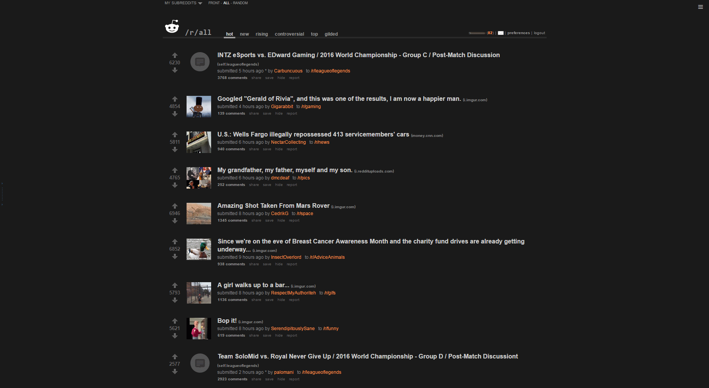
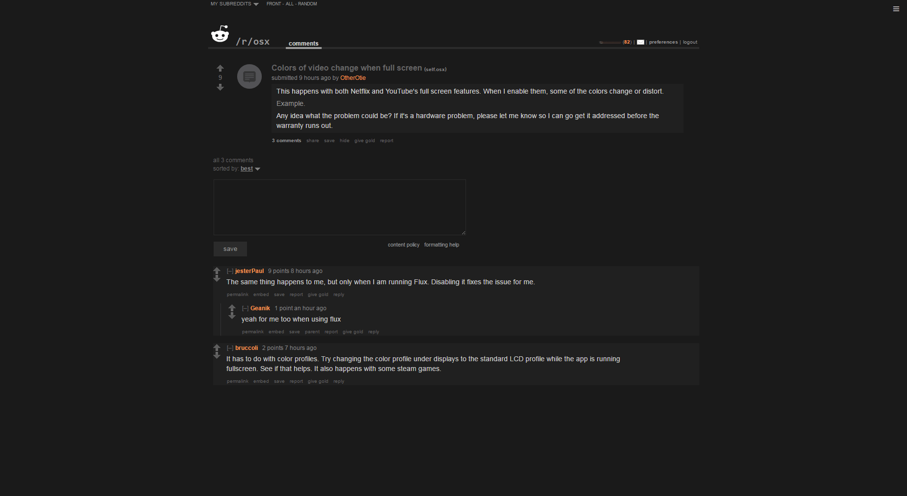

# reddit-no-frills-dark+

Very simple, clean dark reddit theme.

Dark version, includes sidebar and multireddit chooser.

Sidebar shows up on hover (icon in the top right).

Add code to a usertheme or [install with stylish here](https://userstyles.org/styles/133277/reddit-no-frills-dark).

Make sure to turn subreddit styles off on reddit (settings > display > allow subreddits to show me custom themes). 
Or edit the theme to make it only apply to your frontpage.

# screenshots

